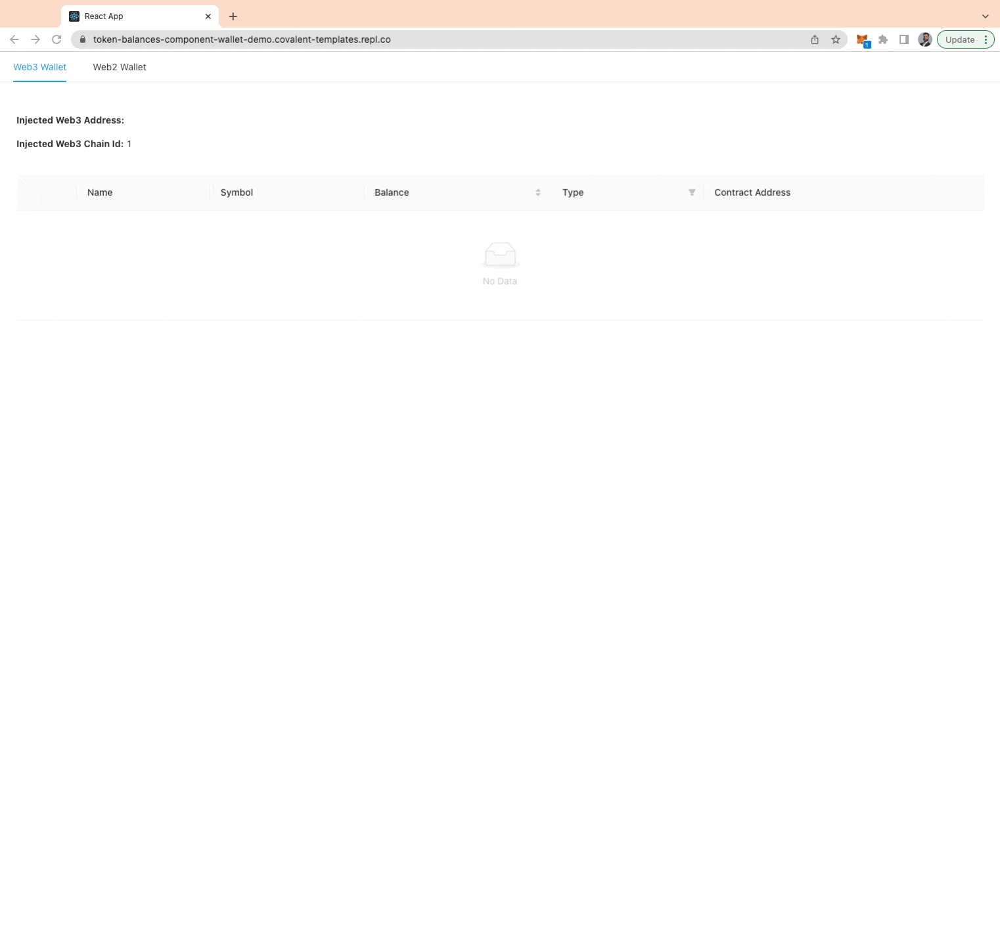

# Wallet Dashboard Demo

**Live demo:** https://covalenthq.github.io/Wallet-Dashboard-Demo

This Wallet Dashboard is a working demo of the `<TokenBalances />` React component, which provides a complete and paginated balances table with all the ERC20 tokens and NFTs for a given wallet address and chainId.



The `<TokenBalances />` React component can be found in the Covalent [web3 components library](https://github.com/covalenthq/web3-resources/tree/main/components).

The Wallet Dashboard demonstrates how to use the `<TokenBalances />` component in either a web3 or web2 setting:

- **Web3 Wallet:** The wallet address and blockchain network `chainId` are taken from the connected wallet provider such as MetaMask to display the token balances. This is for integrating a wallet dashboard into a DApp. 
&nbsp;
- **Web2 Wallet:** The wallet address and blockchain network `chainId` are *manually* entered to display the token balances. This is for apps such as taxation tools. 

## Build details

This Wallet Dashboard demo is built using the `create-react-app` framework and the `<TokenBalances />` React component powered by the [Covalent Unified API](https://covalenthq.com/docs/api).

### Installation

Install with npm: `npm install @covalenthq/web3-components`

or

Install with yarn: `yarn install @covalenthq/web3-components`

### Usage

The `<TokenBalances />` component provides a complete and paginated balances table with all the ERC20 tokens and NFTs for a given wallet `address` and `chainId`.

#### Props:
- `apikey`
- `address`
- `chainId`

The Covalent API Key can be obtained at: https://www.covalenthq.com/platform

#### Sample code:
```jsx
import { TokenBalances } from '@covalenthq/web3-components';

function App() {
  return(
    <div className="TokenBalances">
      <TokenBalances 
        apikey={process.env.REACT_APP_COVALENT_API_KEY} 
        address="demo.eth" 
        chainId="1" 
      />
    </div>
  )
}

export default App;
```

## Feedback & Support
We love our community and want to help *everyone* build in web3 :muscle:

If you have any feedback or need any support with using any of the web3 components or the Covalent API, message us in our [Discord](https://covalenthq.com/discord) in the `#feedback-and-support` channel.
